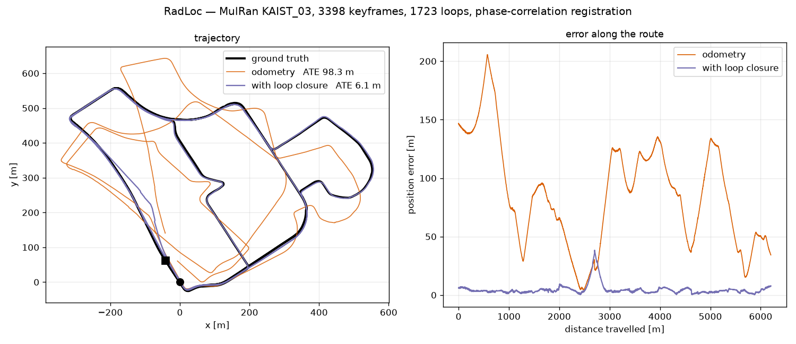

<div align="center">
  <h1>RadLoc</h1>
  <a href="https://arxiv.org/abs/2607.08115"></a>
  <a href="https://sparolab.github.io/research/radloc/"></a>
  <a href="https://www.youtube.com/watch?v=q8iaEpMSANU"></a>
  <a href="LICENSE"></a>
  <br />
  <br />
  
</div>

RadLoc is a radar global descriptor and the SLAM that runs on it. A scan is
reduced to one value per range band, averaged over azimuth, which makes it
rotation invariant and small — forty floats for a place. Loops are registered by
phase correlation, so no correspondences and no initial guess are needed.

```
cpp/radloc/          the C++ core: descriptor, place search, registration
python/radloc/       the same, for research use; checked against the C++
ros2_ws/src/
  radloc_odometry/   radar odometry, publishing descriptors
  radloc_slam/       pose-graph SLAM; writes a session
  ltslam/            multi-session alignment; reads those sessions
docker/              everything runs in one container
```

## Quick start

```bash
docker compose -f docker/docker-compose.yml build
docker compose -f docker/docker-compose.yml run --rm validate   # checks
docker compose -f docker/docker-compose.yml run --rm build      # workspace
docker compose -f docker/docker-compose.yml run --rm slam       # a sequence
```

`slam` takes `SEQUENCE_DIR` and `SAVE_DIR`. What it writes — the pose graph, the
descriptors and the scans — is a session, in the layout `ltslam` reads, so the
single- and multi-session halves meet without a converter.

## SLAM

MulRan `KAIST_03`, 3398 keyframes, 1723 loops. Odometry drifts to 98.3 m against
ground truth; with loop closure the error stays near 6 m for the whole 6.2 km.

<p align="center"></p>

## Multi-session

Two halves of that run, each expressed in its own frame — the second retraces
the first over about 78% of its length. 997 inter-session loops in 18 s.
Measured as the distance from each keyframe of the second session to the nearest
of the first, which needs no external ground truth:

| | p50 | within 5 m |
| --- | --- | --- |
| before | 50.64 m | 8.9% |
| after | 0.59 m | 77.3% |

The ceiling matches the overlap: what has a counterpart is aligned, the rest has
nothing to align to.

## Design notes

**The descriptor is unweighted.** Range weighting — counting distant bands for
more — is applied once, when the coarse search key is built. It belongs to how
two places are compared, not to the place itself.

**Search is two-stage.** A k-d tree over the leading range-weighted bands
proposes candidates; the shortlist is re-ranked on the full unweighted
descriptor, where the shared offset cancels.

**Rotation is disambiguated.** The FFT magnitude is centrally symmetric, so the
log-polar stage recovers rotation only modulo 180°. Both candidates are
de-rotated and the stronger translation peak wins; without this, five rotations
in eight beyond ±90° come back flipped by π.

See `cpp/radloc/README.md` and `python/README.md` for the rest.
